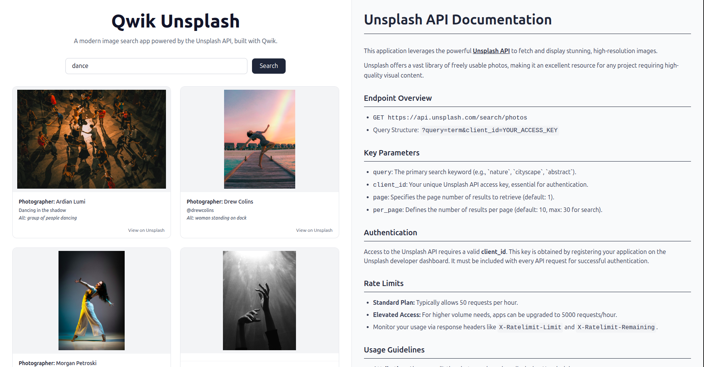

# ⚡ Qwik - Unsplash  App
A High-Performance Visual Discovery Platform
Welcome to the **Qwik - Unsplash Image Search App**, a professional-grade web application engineered for **rapid visual discovery** and **exceptional performance**. This platform seamlessly integrates the cutting-edge **Qwik** framework with the expansive **Unsplash API**, wrapped in a responsive and modern design powered by **Tailwind CSS**.  





##  Key Features  :
- **Instantaneous Live Search** – Real-time search results as you type, fetching high-resolution images from Unsplash with no delays.  
- **Optimized Performance with Qwik** – Built using Qwik's resumability model to ensure lightning-fast load times and smooth navigation.  
- **Responsive, Modern UI** – Designed with **Tailwind CSS** for a sleek, intuitive, and mobile-friendly interface.  
- **Dynamic Image Grid** – An adaptive and intelligent grid layout that highlights each image's beauty, responsive to all screen sizes.  
- **Unsplash API Integration** – Seamlessly connected to Unsplash’s powerful image API for reliable access to free, high-quality photography.  


##  Technology Stack  :

| Technology     | Purpose                                      |  
|----------------|----------------------------------------------|  
| **Qwik**       | Ultra-fast framework using resumable apps    |  
| **Tailwind CSS** | Utility-first CSS for consistent styling  |  
| **Unsplash API** | Access to thousands of free stock images  |  


## Project Structure  :
```plaintext  
├── public/  
│   └── screenshot.png     # Static assets (images, etc.)  
└── src/  
    ├── components/        # Reusable Qwik components  
    └── routes/            # Pages and route handlers (QwikCity)  
```  
- `src/routes`: Manages directory-based routing
- `src/components`: All reusable UI components live here.  
- `public`: Static files accessible directly in the browser.  
🔗 More on routing: [QwikCity Docs](https://qwik.dev/qwikcity/routing/overview/)  
🔗 Static assets: [Vite Public Directory](https://vitejs.dev/guide/assets.html#the-public-directory)  


## Local Development Setup  :

1. **Clone the Repository**  
```bash  
git clone https://github.com/your-username/qwik-unsplash-app.git  
cd qwik-unsplash-app  
```  

2. **Install Dependencies**  
```bash  
npm install  
```  


## Unsplash API Key Configuration  :

1. **Get Your Access Key**  
Visit [Unsplash Developers](https://unsplash.com/developers) and create a new application.  

2. **Create `.env` in the root** and add:  
```env  
PUBLIC_UNSPLASH_ACCESS_KEY=YOUR_UNSPLASH_ACCESS_KEY  
```  
> ⚠️ _Ensure `.env` is not pushed to your GitHub repo._  


## Available Commands  :

### Development Mode  
Launches the development server with SSR support:  
```bash  
npm start  
```  

### Preview Production Build  
Previews the optimized, production-ready build:  
```bash  
npm run preview  
```  

### ️ Build for Production 
Compiles the full app for deployment:  
```bash  
npm run build  
```  


# How to Use  :
1. Enter your search term in the input field (e.g., “forest”, “city”).  
2. Press **Enter** or click the **Search** button.  
3. Browse through a dynamic grid of Unsplash images.  


##  Live Demo  :
> _Deployment in progress..._  
> The live version will be hosted soon via **Vercel** or **Netlify**.  


## Acknowledgements  :
- **Qwik** – For redefining performance standards in web development.  
- **Tailwind CSS** – For elegant and rapid UI development.  
- **Unsplash** – For an incredible repository of visual content.  
- **Vite** – For blazing fast development builds.  
- **Qwik Community** – For support and inspiration.  

## Author :
Developed with passion by **Abinaya**.  
Feel free to fork, star, or contribute to the project.  
